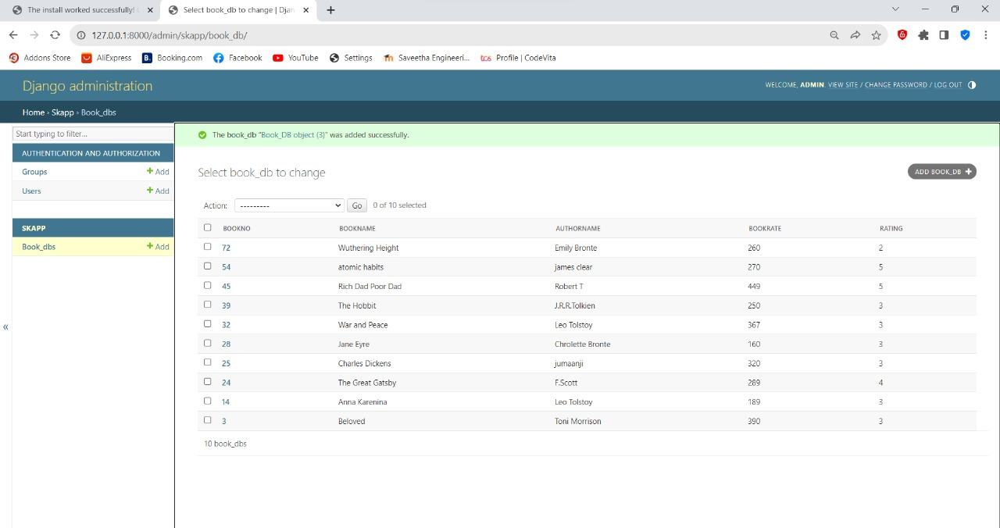

# Ex02 Django ORM Web Application
## Date:  28.02.2024

## AIM
To develop a Django application to store and retrieve data from a Book database using Object Relational Mapping(ORM).

## Entity Relationship Diagram


## DESIGN STEPS

### STEP 1:
Clone the problem from GitHub

### STEP 2:
Create a new app in Django project

### STEP 3:
Enter the code for admin.py and models.py

### STEP 4:
Execute Django admin and create details for 10 books

## PROGRAM
```
models.py
from django.db import models
from django.contrib import admin
class Book_DB(models.Model):
      bookno=models.IntegerField(primary_key = True);
      bookname=models.CharField(max_length = 20);
      authorname=models.CharField(max_length = 25);
      bookrate=models.IntegerField(primary_key = True);
      rating=models.CharField(max_length = 20);
class Book_DBAdmin(admin.ModelAdmin):
     list_display=("bookno","bookname","authorname","bookrate","rating");

admin.py
from django.contrib import admin 
from .models import libraryBook,libraryBookAdmin
admin.site.register(libraryBook,libraryBookAdmin)
```
## OUTPUT




## RESULT
Thus the program for creating a database using ORM hass been executed successfully
